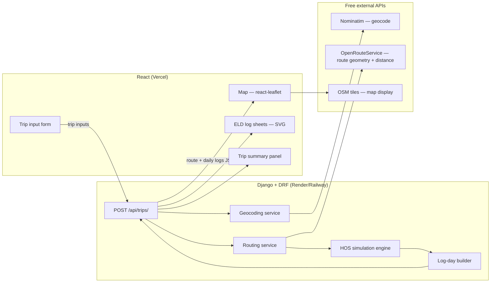

# ELD Trip Planner — my architecture & build plan

Notes to myself before I write any code. The assessment is a Django + React app that takes trip
details and outputs route instructions plus drawn ELD daily logs.

The thing I want to keep in mind throughout: they test the hosted version for accuracy **and**
judge the UI/UX. Good design partially compensates for output inaccuracies, so I should budget
real time for the log-sheet rendering and the map — those are what a reviewer sees first.

---

## 1. What I'm actually building

A driver enters four things — current location, pickup, dropoff, and hours already used in their
70/8 cycle — and the app returns:

1. A **map** with the route drawn and every stop marked (pickup, dropoff, fuel, 30-min breaks,
   10-hour rests).
2. A set of **ELD daily log sheets**, one per calendar day of the trip, with the duty-status grid
   drawn in and the remarks filled out.

The hard part isn't the map. It's the **Hours-of-Service simulation** that turns a raw route into
a legally-compliant sequence of duty statuses, then slices that sequence across midnight
boundaries into individual log sheets. If I get that engine right, everything else is
presentation.

### Fixed assumptions from the brief (bake these in as constants)

- Property-carrying driver, **70 hours / 8 days**, no adverse driving conditions.
- **Fueling at least once every 1,000 miles.**
- **1 hour** on-duty for pickup, **1 hour** on-duty for dropoff.

---

## 2. System architecture



**The whole flow in one sentence:** the form POSTs the four inputs, Django geocodes and routes
them, the HOS engine simulates the drive and inserts stops/breaks/rests, the log builder cuts
that timeline into per-day sheets, and the whole thing comes back as one JSON payload the
frontend renders.

---

## 3. Stack, and why I picked each piece

| Layer | Choice | Reasoning |
|---|---|---|
| Backend framework | **Django + Django REST Framework** | Required by the brief. DRF gives me clean serializers and a browsable API, which will demo well in the Loom. |
| Frontend | **React (Vite)** | Required. Vite over CRA — faster, and deploys cleanly to Vercel. |
| Map display | **react-leaflet + OpenStreetMap tiles** | Free, no API key, no billing. Draws polylines and markers easily. |
| Routing (distance, duration, geometry) | **OpenRouteService** | Free API key, returns route geometry + distance + duration. Has an HGV (truck) profile, which should read well in the Loom. |
| Geocoding (address → lat/lng) | **Nominatim** | Free. I need to respect the 1 req/sec limit and cache results. |
| Backend hosting | **Render** or **Railway** free tier | Vercel doesn't host long-running Django well, so I'll host the API separately and point the frontend at it. |
| Frontend hosting | **Vercel** | What the brief suggests. Only the React app lives here. |

> Deployment gotcha to remember: the brief says "can use Vercel.app," but that's for the
> frontend. Django needs its own host. I'll put the backend URL in a React environment variable
> (`VITE_API_BASE_URL`) so local and hosted builds both work, and enable CORS on Django for the
> Vercel domain.

### Backup APIs, in case one rate-limits me mid-demo

- Routing: OSRM public demo server, or Geoapify routing (free tier).
- Geocoding: Geoapify or LocationIQ free tier.

I'll keep the routing and geocoding calls behind my own service classes so swapping providers is
a one-file change rather than a refactor.

---

## 4. Data model

I could run this **stateless** (compute and return, persist nothing) or **persist** each trip so
it has a shareable URL. Persisting looks better in a demo and is barely more work, so that's the
way I'm leaning. Tables:

**Trip**
- `id`, `current_location` (text), `pickup_location` (text), `dropoff_location` (text)
- `current_cycle_used` (float, hours)
- `total_distance_miles`, `total_drive_hours`, `total_days` (computed)
- `created_at`

**RouteStop** (FK → Trip) — everything that goes on the map
- `kind`: one of `start | pickup | dropoff | fuel | break_30 | rest_10 | restart_34`
- `label`, `latitude`, `longitude`
- `arrive_at`, `depart_at` (datetimes on the trip clock)
- `sequence` (int, ordering)

**LogDay** (FK → Trip) — one per calendar day / one log sheet
- `date`
- `total_off_duty`, `total_sleeper`, `total_driving`, `total_on_duty` (floats; the four
  right-hand totals, must sum to 24)
- `total_miles` (miles driven that day)

**DutySegment** (FK → LogDay) — one drawn line on the grid
- `status`: `off_duty | sleeper | driving | on_duty`
- `start_minute` (0–1440, minutes from midnight home-terminal time)
- `end_minute`
- `remark` (city/location string shown under the grid at the status change)

The frontend draws each `LogDay` from its ordered `DutySegment` list. Keeping segments in
**minutes from midnight** should make the SVG math trivial (see §7).

---

## 5. API contract

I want to keep this to essentially one endpoint — everything the frontend needs comes back in one
response.

**`POST /api/trips/`**

Request:
```json
{
  "current_location": "Chicago, IL",
  "pickup_location": "Indianapolis, IN",
  "dropoff_location": "Columbus, OH",
  "current_cycle_used": 12.5
}
```

Response (shape only — a spec for myself, not code):
```json
{
  "trip": {
    "id": 42,
    "total_distance_miles": 545,
    "total_drive_hours": 9.9,
    "total_days": 2,
    "cycle_hours_remaining": 47.5
  },
  "route": {
    "geometry": [[41.87, -87.62], [39.76, -86.15], "..."],
    "stops": [
      { "kind": "start",   "label": "Chicago, IL",      "lat": 41.87, "lng": -87.62, "arrive_at": "...", "depart_at": "..." },
      { "kind": "pickup",  "label": "Indianapolis, IN", "lat": 39.76, "lng": -86.15, "arrive_at": "...", "depart_at": "..." },
      { "kind": "fuel",    "label": "near Dayton, OH",  "lat": 39.75, "lng": -84.19, "arrive_at": "...", "depart_at": "..." },
      { "kind": "dropoff", "label": "Columbus, OH",     "lat": 39.96, "lng": -82.99, "arrive_at": "...", "depart_at": "..." }
    ]
  },
  "logs": [
    {
      "date": "2025-01-15",
      "totals": { "off_duty": 10.0, "sleeper": 0.0, "driving": 8.0, "on_duty": 6.0 },
      "total_miles": 440,
      "segments": [
        { "status": "off_duty", "start_minute": 0,   "end_minute": 360,  "remark": "Chicago, IL" },
        { "status": "on_duty",  "start_minute": 360, "end_minute": 420,  "remark": "Chicago, IL — pre-trip" },
        { "status": "driving",  "start_minute": 420, "end_minute": 660,  "remark": "" }
      ]
    }
  ]
}
```

Validation errors (bad address, cycle > 70) come back as `400` with a clear message the form can
show. A reviewer will definitely try a bad address, so this needs to read cleanly.

---

## 6. The HOS simulation engine — the core

This is the piece that earns the accuracy points. I'm modelling it as a **clock-based simulation**
that walks the route segment by segment while tracking four running counters.

### Constants

```
MAX_DRIVE_PER_WINDOW   = 11 h      # driving cap inside a window
DRIVING_WINDOW         = 14 h      # on-duty window; no driving after this
BREAK_AFTER_DRIVING    = 8 h       # cumulative driving before a 30-min break
BREAK_LENGTH           = 30 min
REQUIRED_RESET_OFF     = 10 h      # consecutive off-duty to reset window + 11h
CYCLE_LIMIT            = 70 h      # over rolling 8 days
RESTART                = 34 h      # off-duty to reset the cycle
FUEL_EVERY             = 1000 mi
FUEL_STOP_LENGTH       = 30 min    # brief doesn't fix this — my choice, state it
PICKUP_LENGTH          = 60 min
DROPOFF_LENGTH         = 60 min
AVG_SPEED              = 55 mph    # convert distance → drive time
```

> On speed: I could trust the routing API's `duration`, but a fixed 55 mph keeps the HOS math
> predictable and defensible on camera. Whichever I pick, I need to state it out loud.

### Running counters

- `drive_in_window` — hours driven since the last 10-hour reset (cap 11).
- `window_elapsed` — hours since the window started (cap 14).
- `drive_since_break` — cumulative driving since the last 30-min break (triggers at 8).
- `cycle_used` — starts at `current_cycle_used`; every on-duty and driving minute adds to it
  (cap 70).

### The algorithm, in pseudocode

```
geocode(current, pickup, dropoff)
legs = [ route(current → pickup), route(pickup → dropoff) ]

clock = start_of_day        # or now; use home-terminal timezone
emit OFF_DUTY until clock   # so day 1 starts off-duty like the FMCSA example

for each leg in legs:
    remaining_miles = leg.distance
    while remaining_miles > 0:

        # 1. Do I need a reset before driving more?
        if drive_in_window >= 11 OR window_elapsed >= 14:
            insert REST_10 (off-duty/sleeper)      # emits a segment, advances clock 10h
            reset drive_in_window, window_elapsed, drive_since_break
            continue

        # 2. Do I need a 30-min break?
        if drive_since_break >= 8:
            insert BREAK_30 (off-duty)
            reset drive_since_break
            continue

        # 3. Drive the next chunk — the smallest of:
        #    (a) miles left in leg
        #    (b) miles until 11h driving cap
        #    (c) miles until 14h window cap
        #    (d) miles until 8h break trigger
        #    (e) miles until next 1000-mi fuel stop
        chunk = min(a, b, c, d, e)
        emit DRIVING for chunk
        advance clock, add to all counters, subtract from remaining_miles

        # 4. Fuel stop landed?
        if odometer crossed a 1000-mi multiple:
            insert FUEL (on-duty not driving)

    # end of leg → pickup or dropoff action
    if leg ended at pickup:  insert ON_DUTY 60 min (pickup)   ; cycle_used += 1
    if leg ended at dropoff: insert ON_DUTY 60 min (dropoff)  ; cycle_used += 1

    # 5. Cycle guard — check throughout, not just here
    if cycle_used >= 70 and trip not finished:
        insert RESTART_34 (off-duty) ; cycle_used = 0
```

Every `emit`/`insert` appends a `(status, start_time, end_time, location)` record to a flat
timeline. That timeline is my single source of truth. **Then I cut it into days.**

### Splitting the timeline into log sheets

Walk the flat timeline. Wherever a segment crosses **midnight (home-terminal time)**, split it
into two at the boundary. Group segments by calendar date → each group is one `LogDay`. For each
day, sum minutes per status into the four totals (they must total 24h). Convert each segment's
absolute time to `start_minute`/`end_minute` from that day's midnight.

### Correctness checks to build as tests

These are my success criteria for the engine — write them first, then make them pass:

- Every day's four totals sum to exactly 24:00.
- No `driving` segment ever starts after 14h of window elapsed.
- `drive_in_window` never exceeds 11h between resets.
- A 30-min non-driving break appears before cumulative driving passes 8h.
- `cycle_used` never exceeds 70 without a 34-h restart in between.
- Fuel stop count == floor(total_miles / 1000).
- Pickup and dropoff each add exactly 1h on-duty.

These map directly onto the FMCSA guide's examples — the "Completed Grid/Log" on pages 18–19 is a
good sanity fixture to check my output against.

---

## 7. Drawing the ELD log sheet (SVG)

I'm reproducing the standard grid in **SVG**, not canvas — it's crisp at any zoom, easy to
generate from data, and prints/screenshots well for the Loom.

**Grid anatomy** (matches the blank log form):
- Four horizontal rows, top to bottom: **Off Duty, Sleeper Berth, Driving, On Duty (Not
  Driving)**.
- X-axis: **Midnight → Midnight**, 24 hour columns, each divided into 4 (15-minute) ticks.
- Right edge: a **totals column** showing each row's hour sum; they add to 24.
- Below the grid: **Remarks** row with location labels dropped at each duty-status change.
- Header: date, miles, carrier, truck/trailer numbers, driver name.

**Rendering logic:**
- Horizontal pixel position = `start_minute / 1440 * grid_width`.
- Row Y = fixed per status.
- For each `DutySegment`, draw a horizontal line across its `[start_minute, end_minute]` on its
  status row.
- At each status change, draw a **vertical connector** between the two rows so the trace is
  continuous — this is what makes it read as a real log rather than floating dashes.
- Drop the `remark` text vertically under the grid at the change point (angled text like the
  FMCSA sample reads well).

**Multi-day:** one `<LogSheet>` component per `LogDay`, stacked or paginated. Longer trips mean
more sheets, which is explicitly in the brief — so I need to check that a 2–3 day trip really does
render several sheets.

---

## 8. Frontend structure

```
src/
├── api/            # one client function: postTrip(inputs) -> response
├── components/
│   ├── TripForm/       # 4 inputs + validation + submit
│   ├── RouteMap/       # react-leaflet: polyline + typed markers + legend
│   ├── TripSummary/    # distance, drive time, days, cycle remaining
│   ├── LogSheet/       # SVG grid for ONE day
│   └── LogSheetList/   # maps over logs[] -> many LogSheet
└── App / router
```

Things I don't want to skip, because they're cheap and they're what gets judged:

- **Marker styling:** distinct icons/colours per stop `kind` (pickup, dropoff, fuel, break, rest)
  plus a legend. Cheap to do and makes the map look considered.
- **Loading + error states** on submit — a reviewer will try a bad address.
- **Responsive:** the log grid is wide; allow horizontal scroll on mobile rather than squashing
  it.

---

## 9. Deployment

1. **Backend → Render/Railway.** Set `ALLOWED_HOSTS`, `DEBUG=False`, database URL, and the
   OpenRouteService API key as env vars. Add `django-cors-headers` and allow the Vercel origin.
2. **Frontend → Vercel.** Set `VITE_API_BASE_URL` to the Render URL. Build with Vite.
3. **Smoke test the hosted pair** end-to-end before recording — cold-start free tiers can be slow
   on first request, so hit it once to warm it right before the Loom.

---

## 10. Build order

Doing it in this order so I always have something demoable:

1. **HOS engine in isolation** — pure functions, no Django, with the §6 tests. This is the risky
   part; nail it first with hardcoded distances.
2. **Routing + geocoding services** — wrap OpenRouteService + Nominatim behind service classes.
3. **Django API** — wire services + engine into `POST /api/trips/`, return the §5 payload.
4. **React form + summary** — get a round trip working with plain output.
5. **RouteMap** — draw the polyline and markers.
6. **LogSheet SVG** — the showpiece. Iterate against the FMCSA "Completed Grid."
7. **Polish** — styling, legend, loading/error states, multi-day pagination.
8. **Deploy + smoke test + record Loom.**

---

## 11. Deliverables checklist (from the brief)

- [ ] Live hosted version (Vercel frontend + Render/Railway backend).
- [ ] GitHub repo, clean README with setup and the assumptions I made.
- [ ] 3–5 min Loom walking through the app *and* the code.
- [ ] Inputs: current location, pickup, dropoff, current cycle used.
- [ ] Outputs: route map with stops/rests + filled ELD log sheets (multiple for long trips).
- [ ] HOS logic: 70/8, 11h drive, 14h window, 30-min break, fuel every 1000 mi, 1h pickup +
      1h dropoff.

**For the Loom:** state my assumptions out loud (speed, fuel-stop length), show a short trip *and*
a multi-day trip so the multi-sheet logic is visible, and spend 30 seconds on the HOS engine code
since that's the real signal of competence.
